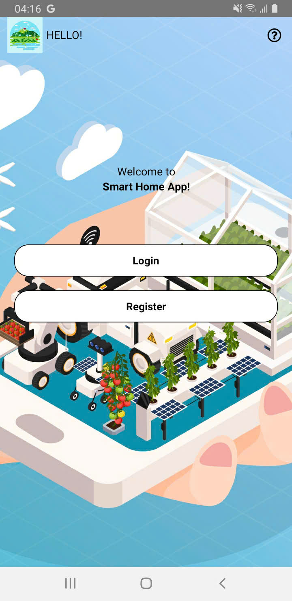
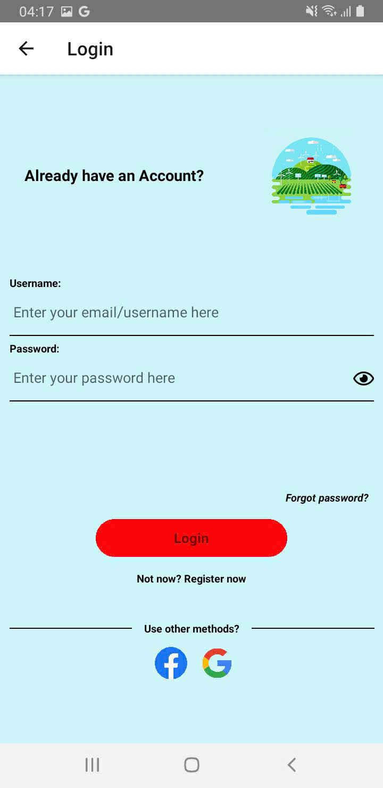
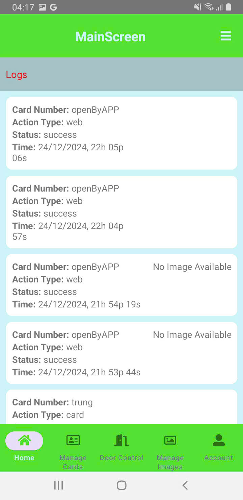
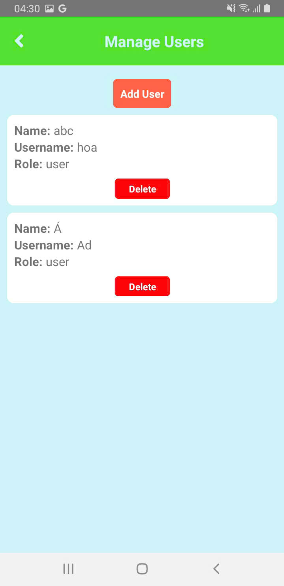
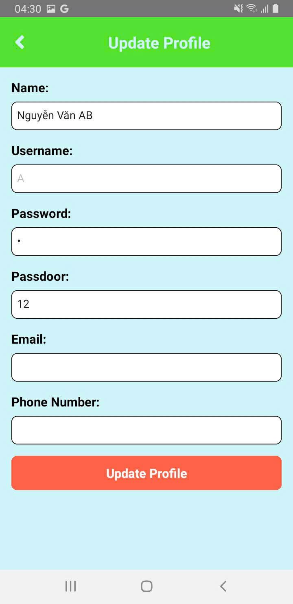
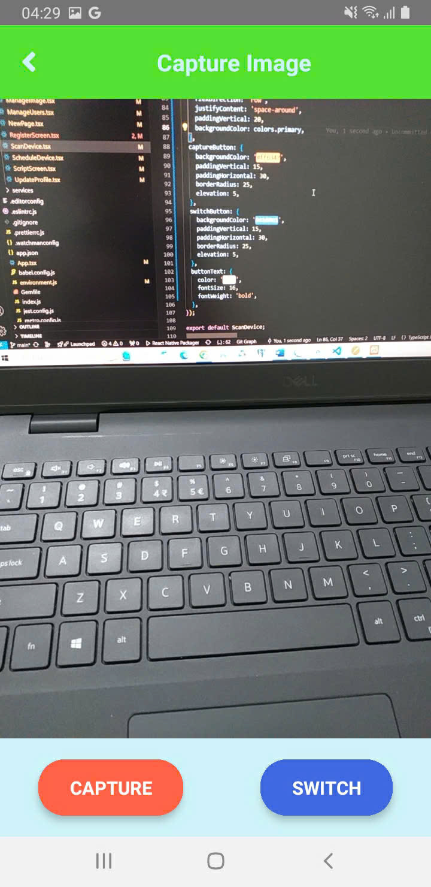
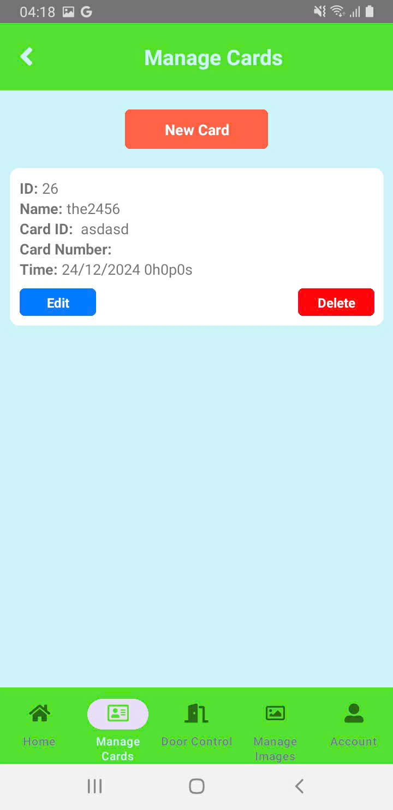
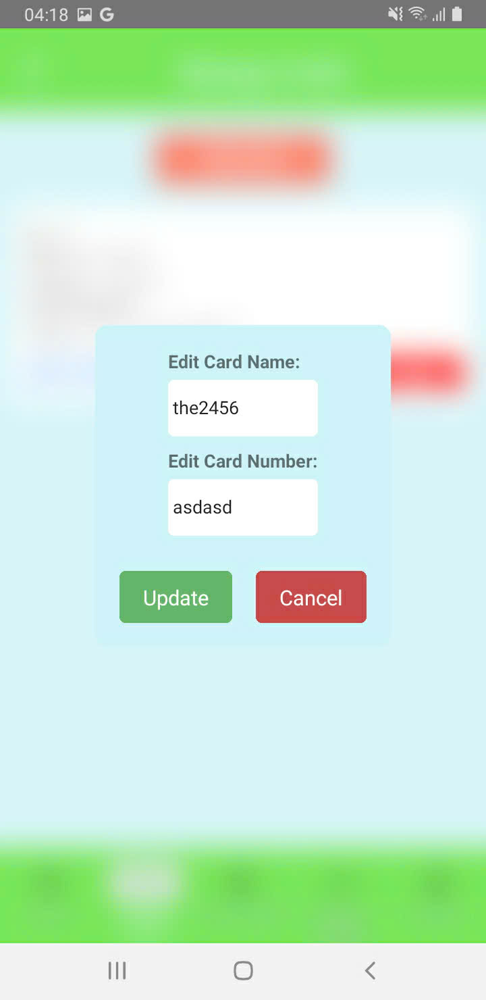

# MOBILE APP IOT

## Tổng quan

Ứng dụng Smart Door là ứng dụng giúp người dùng điều khiển thiết bị thông minh thông thông qua điện thoại. Ứng dụng mang lại giao diện thân thiện, dễ sử dụng, giúp người dùng dễ dàng điều khiển thiết bị thông minh mọi lúc mọi nơi.

## Mô tả

Ứng dụng Smart Door cho phép người dùng mở cửa thông qua điện thoại, người dùng có thể mở cửa từ xa thông qua ứng dụng. Ứng dụng phân quyền truy cập của người dùng .Ứng dụng còn cho phép người dùng xem lịch sử mở cửa, thêm, xóa người dùng, thêm, xóa thiết bị, xem thông tin thiết bị, xem thông tin người dùng.

## Cài đặt

1. Clone project về máy `git clone https://github.com/Huyhoa1010/Smart_Door.git`
2. Mở project bằng Android Studio
3. Chạy lệnh `npm install` để cài đặt các thư viện cần thiết
4. Chạy lệnh `yard start` để khởi chạy project
3. Chạy project trên máy ảo hoặc thiết bị thật bằng cách chạy lệnh `yard android` hoặc `yard ios`
4. Chờ đợi và sử dụng ứng dụng

## Một số hình ảnh

Giao diện ban đầu

Giao diện đăng nhập

Giao diện màn hình chính

Giao diện quản lý người dùng

Giao diện thông tin người dùng

Giao diện quản lý ảnh

Giao diện thẻ từ

Giao diện sửa thẻ

